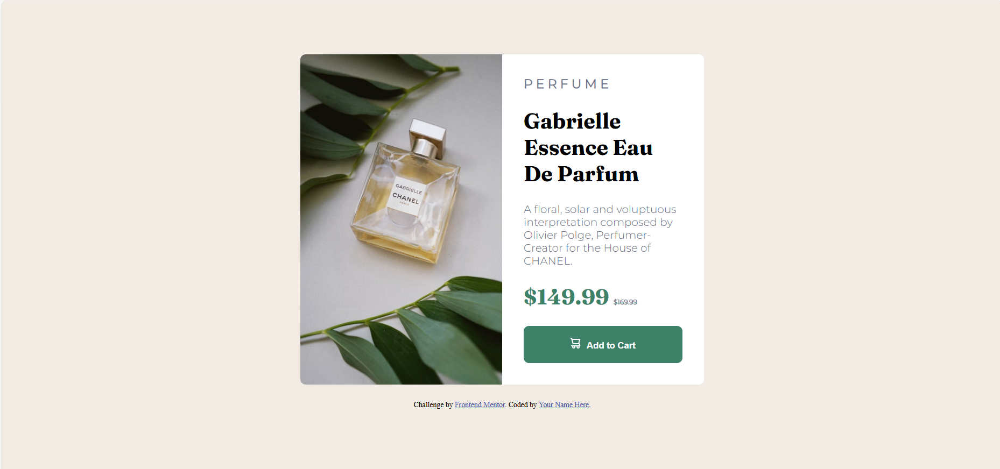

# Frontend Mentor - Product preview card component solution

This is a solution to the [Product preview card component challenge on Frontend Mentor](https://www.frontendmentor.io/challenges/product-preview-card-component-GO7UmttRfa). Frontend Mentor challenges help you improve your coding skills by building realistic projects. 

## Table of contents

- [Overview](#overview)
  - [The challenge](#the-challenge)
  - [Screenshot](#screenshot)
  - [Links](#links)
- [My process](#my-process)
  - [Built with](#built-with)
  - [What I learned](#what-i-learned)
  - [Continued development](#continued-development)
  - [Useful resources](#useful-resources)
- [Author](#author)
- [Acknowledgments](#acknowledgments)

## Overview

### The challenge

Users should be able to:

- View the optimal layout depending on their device's screen size
- See hover and focus states for interactive elements

### Screenshot



### Links

- Solution URL: [solution URL here](https://www.frontendmentor.io/solutions/product-review-project-perfume-v2LE1AKDbg)
- Live Site URL: [live site](https://kifiloe3.github.io/Product-Review-project-Perfume/)

## My process

### Built with

- Semantic HTML5 markup
- CSS custom properties
- Flexbox
- CSS Grid
- Mobile-first workflow

### What I learned

when I was doing this project, I learned:

- How to structure HTML using semantic tags
- Why using clear and specific names for classes/containers (like `.product-card` instead of `.box1`).It makes the code easier to understand and maintain.  
- about the importance of orgainsed CSS for readability
- How to use CSS for layout(Centering and spaciing)
- how to make the design responsive from mobile design to desktop using media queries

This is the example of a good way of naming classes/containers

```html
<h1 class="price-heading">
  $149.99
  <del>
    <small>$169.99</small>
  </del>
</h1>
```
This is shortcut way of centering the main container using CSS styles. i prefer to use this way because centering using the flex box may be time consuming and many  style needs to be applied.

```css
main{
  margin: 0 auto;
}
```
### Continued development

I’ve noticed that I sometimes take more time than I plan when working on projects. Going forward, I’d like to improve at pacing myself so I can finish on time without feeling rushed.

### Useful resources

- [ChatGPT](https://chatgpt.com) - This helped me with applying styles that made my project to look exactly like the one i had to  create on figma and also short cut of applying styles

- [Figma](https://www.figma.com) - This is the website that gives me Frontend Mentor projects designs. It gave me the exact styles tha I needed.

## Author

- Frontend Mentor - [@yourusername](https://www.frontendmentor.io/profile/yourusername)

## Acknowledgments

Xolani Dube who is my Trainer helped with applying styles on my projects where I struggled and showed the better way to apply styles and with using inspection to check the spacing In between my content e.g margin, paddimg which helped me to also check extra spaces added that might make the project not good or the way Its supposed look.

